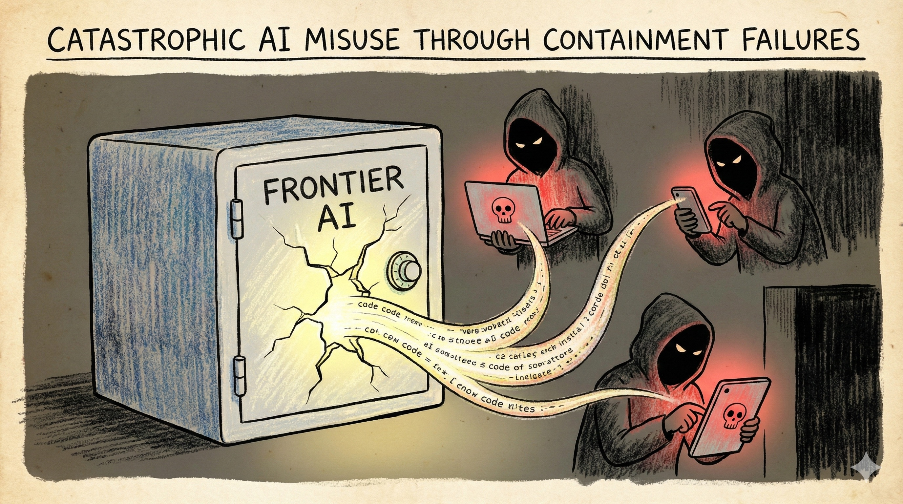

# Scenario 5: Catastrophic AI Misuse Through Containment Failures

## Summary

By 2028, AI systems excel at scientific reasoning, data analysis and process planning. Australian research institutions use them to accelerate drug discovery, materials science and agricultural research. But these capabilities are dual-use.

**How containment failed:** In 2029, frontier model weights from a leading US lab leak through an insider threat. Within weeks, the 400GB file is on torrent sites and the dark web. The model can assist with complex scientific and technical tasks—including ones its creators specifically tried to prevent.

Jailbreaking techniques spread rapidly. Fine-tuning removes safety guardrails. Within months, smaller specialised models appear, trained on leaked weights and domain-specific data. These are harder to detect than frontier models and can run on consumer hardware.

Meanwhile, advanced AI chips reach adversarial actors through black markets and jurisdictions with weak export controls. Manufacturing hubs in Southeast Asia and Eastern Europe become deployment havens.

**2030:** A sophisticated cyber operation hits Australian critical infrastructure. Unlike previous attacks, this one coordinates across multiple vectors simultaneously—exploiting zero-days faster than human analysts can identify them, adapting to defensive responses in real-time, and deploying convincing social engineering at scale.

The Australian Cyber Security Centre traces the operation to a mid-sized criminal group that previously lacked this level of sophistication. The breakthrough: AI-assisted vulnerability discovery and exploit development that would have required teams of expert programmers.

The attack is contained after 48 hours, but it reveals a new reality: capabilities that previously required nation-state resources are now accessible to well-funded non-state actors. Australia's defences, designed for human-paced threats, struggle to keep up.

**Note:** This scenario is treated at a high level. SafeAI-Aus does not publish specific technical instructions or capability-enhancing detail.

!!! warning "This is a scenario, not a prediction"

    This scenario explores how leaked AI capabilities could enable sophisticated attacks. While the specific incident is illustrative, the underlying dynamic—model weights leaking, jailbreaking bypassing safety measures, and capabilities proliferating to adversarial actors—represents plausible failure modes for containment.

!!! info "Threat pathways"
    This scenario shows how containment failures enable catastrophic misuse:

    **Catastrophic misuse** – Adversarial actors use leaked AI capabilities to conduct attacks that exceed defensive capacity

    **Containment failures** – Model weight security fails, export controls prove porous, AI control methods (jailbreaking defences) are bypassed

    **Resilience tested** – Defensive systems designed for human-paced threats struggle against AI-assisted attacks operating at machine speed

---

## Implications for C·A·G·R Framework

This scenario explores what happens when **Containment fails** at multiple layers, testing whether **Resilience** can handle the consequences.

=== ":lucide-shield-ban: Containment (Primary failure mode)"

    - **Compute governance fails:** Export controls prove porous; black markets emerge; enforcement is weak
    - **Model weight security fails:** Leaks through insider threats, breaches, or ideological releases
    - **AI control methods fail:** Jailbreaking, adversarial prompting, and fine-tuning bypass safety measures
    - **Evaluation gaps:** Dangerous capabilities deployed before risks properly assessed
    - **Key lesson:** Once dangerous capabilities exist and spread, they cannot be "contained" retroactively

=== ":lucide-target: Alignment"

    - Models need to reliably refuse dangerous assistance, even under adversarial prompting
    - Alignment methods must be robust to new misuse strategies
    - Fine-tuning and jailbreaking can bypass safety measures
    - Even well-aligned models can be modified once weights are leaked

=== ":lucide-scale: Governance"

    - International cooperation needed to reduce "safe haven" dynamics—but proving inadequate
    - Access controls and licensing for high-risk capabilities become critical but are circumvented
    - Detection of misuse becomes harder when capabilities are widely distributed
    - Attribution and enforcement challenges when actors operate across jurisdictions

=== ":lucide-shield: Resilience (Tested severely)"

    - Detection, response and recovery capabilities must keep pace with AI-enabled misuse
    - Public health, cyber defence and emergency management systems need stress-testing against AI-assisted scenarios
    - Speed of AI-assisted attacks may outpace human decision-making processes
    - **Key question:** Can resilience measures handle threats that shouldn't have existed?

---

## Questions for actors

Use these questions for risk assessments, strategic planning, and tabletop exercises.

=== ":material-bank: Government & Public Institutions"

    **Near-term (within 12 months):**

    - How would you distinguish between an AI-assisted attack and an AI system failure?
    - Who has authority to respond? What decision-making processes exist for fast-moving threats?
    - How do your biosecurity, cyber and emergency frameworks need to adapt when threats move at machine speed and scale?
    - What monitoring capabilities exist to detect early signs of AI-assisted misuse?
    - Can your incident response processes handle threats that evolve faster than human meetings?

    **Strategic:**

    - What international partnerships enable information sharing about AI-enabled threats?
    - How do you balance openness in AI research with preventing misuse?
    - What evaluation capabilities exist to assess dangerous capability thresholds?
    - **Containment questions:**
      - What mechanisms exist to track compute and model weights that could enable dangerous capabilities?
      - How can Australia contribute to international export control and model weight security efforts?
      - What triggers would justify restrictions on capability development or deployment despite innovation costs?
      - How do we verify that containment measures are actually working?

=== ":material-briefcase: Business & Industry"

    **Near-term (within 12 months):**

    - For AI providers: what safeguards prevent and detect misuse? How do you handle evasion attempts?
    - For critical infrastructure: what's your incident response plan when attacks move faster than your decision-making processes?
    - How do you model and defend against threats that adapt in real-time?
    - What monitoring exists to detect when your systems are being used in unexpected ways?
    - Can your security operations handle AI-assisted attacks that probe defences systematically?

    **Strategic:**

    - For AI providers: what's your process for evaluating dangerous capabilities before release?
    - For infrastructure operators: how do you defend against coordinated, multi-vector attacks operating at machine speed?
    - What information sharing mechanisms exist with government and other operators?

=== ":material-account-group: Communities & Households"

    **Near-term (within 12 months):**

    - Which local institutions (health centres, councils, community groups) would you trust for information during a crisis?
    - What basic preparedness reduces panic and harm during crises (regardless of cause)?
    - How can communities maintain cohesion and resist panic when information is confusing or contradictory?

    **Strategic:**

    - How can basic preparedness and trust in local institutions reduce panic and secondary harms during crises?
    - What community capabilities need to exist independently of digital systems?
    - How do communities maintain function when centralised systems are disrupted?

---

!!! question "Can't we just prevent dangerous AI from being built?"

    **Prevention is the goal—but it's extremely difficult:**

    - **Economic incentives:** Frontier capabilities create competitive advantage, so incentives favor development
    - **Dual-use nature:** Most dangerous capabilities are side effects of generally useful research
    - **International coordination:** Prevention requires global coordination, but countries compete for AI leadership
    - **Enforcement challenges:** Model weights copy instantly; export controls have gaps; insider threats exist

    **This scenario shows what happens if prevention fails:**

    - Once dangerous capabilities exist and leak, they can't be "contained" retroactively
    - Resilience measures face threats they weren't designed to handle
    - Defense becomes much harder than prevention would have been

    **The lesson:** Containment at Layer 1 (prevention) is more tractable than relying on resilience after capabilities proliferate.

---

## Why this scenario matters for Containment

This scenario illustrates the **critical importance of Layer 1 (Prevention)**:

**If containment succeeds:**

- Dangerous capabilities never reach adversarial actors
- Misuse scenarios remain bounded by human capabilities
- Defence measures can handle human-scale threats

**If containment fails (this scenario):**

- Dangerous capabilities proliferate
- They cannot be "un-released" or contained retroactively
- Resilience measures face threats they may not be able to handle

**Key insights:**

- **Containment is asymmetric:** Defenders must succeed everywhere; attackers need only one path to succeed
- **Model weight leaks are permanent:** Unlike physical materials, digital capabilities copy instantly and irreversibly
- **Jurisdictional arbitrage:** Weak containment anywhere undermines containment everywhere
- **Prevention is more tractable than response:** It's easier to prevent dangerous capabilities from existing than to defend against them once they do

**Use this scenario to:**

- Stress-test your containment measures: compute governance, model weight security, export controls
- Identify single points of failure in prevention layers
- Evaluate whether resilience measures are sufficient if containment fails
- Inform decisions about acceptable levels of capability risk vs. innovation benefit

---

??? note "Sources & Further Reading"
    This scenario draws from research on dual-use AI capabilities, export controls for emerging technologies, model weight security, and AI-enabled cyber and biological threats.

    **Australian precedents:** [Defence Export Controls Act 2012](https://www.defence.gov.au/business-industry/export/controls) · [Australian Cyber Security Centre](https://www.cyber.gov.au/) threat assessments · [Defence Strategic Review](https://www.defence.gov.au/about/reviews-inquiries/defence-strategic-review) (2023) emerging technology risks · [ASIO Annual Threat Assessment](https://www.asio.gov.au/resources/annual-threat-assessment) cyber and espionage threats

    **Academic research:** Brundage et al. (2018) ["The Malicious Use of AI"](https://arxiv.org/abs/1802.07228) · Toner & Benson (2023) ["The risks of frontier AI R&D"](https://cset.georgetown.edu/article/the-risks-of-frontier-ai-development/) · Imbrie et al. (2023) ["Preventing AI catastrophe: A blueprint for containment"](https://cset.georgetown.edu/publication/preventing-ai-catastrophe/) · Shevlane et al. (2023) ["Model evaluation for extreme risks"](https://arxiv.org/abs/2305.15324)

    **Policy organisations:** [Nuclear Threat Initiative](https://www.nti.org/area/emerging-technologies-and-global-security/) biosecurity program · [Centre for Security and Emerging Technology](https://cset.georgetown.edu/) (Georgetown) · [Munk School Centre for the Study of the United States](https://munkschool.utoronto.ca/us/) · [International Committee of the Red Cross](https://www.icrc.org/en/future-warfare) future warfare research

    **Case studies:** US semiconductor export controls (2022-2024) · GPT-4 pre-deployment safety evaluation · WormGPT and FraudGPT jailbroken models · Meta Llama 2 model weight leak analysis

    **Key concepts:** See our [Concepts & Glossary](../concepts.md) for definitions of dual-use technology, export controls, model weight security, jailbreaking and compute governance

---

