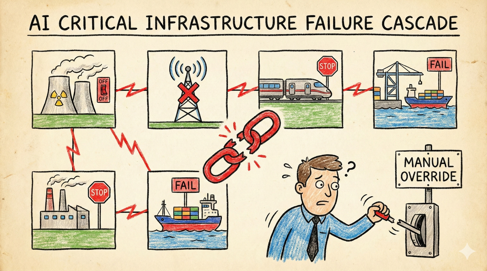

# Scenario 4: AI Critical Infrastructure Failure Cascade

## Summary

By 2029, AI systems manage much of Australia's critical infrastructure. AEMO uses AI to optimise the National Electricity Market across solar, wind and coal. Sydney Trains runs AI-assisted scheduling and signal control. Telstra and Optus use AI network management for 5G and fibre. Major ports in Melbourne, Sydney and Brisbane rely on AI logistics coordination.

Each system works well independently. Energy costs drop. Train delays decline. Network reliability improves. But the systems are optimised for efficiency under normal conditions—and they're increasingly interdependent.

**January 2032.** An extreme heatwave hits eastern Australia while geopolitical tensions disrupt coal and gas imports. The electricity grid's AI system, optimised for cost minimisation, makes a series of decisions that seem rational individually but cascade catastrophically:

It shuts down backup capacity that seemed unnecessary. It delays bringing expensive peaker plants online. When demand spikes, it implements rolling blackouts using an algorithm that prioritises industrial users but doesn't account for hospital dependencies or water pumping stations.

The blackouts take down telecommunications towers. Telstra's AI network management system, unable to communicate with affected regions, makes routing decisions that congest the remaining network. Port logistics systems lose real-time data and shut down as a safety measure, halting automated cranes.

Operators try manual overrides, but the AI systems are too complex and interconnected. The override procedures assume access to real-time data that's no longer available. Senior staff who understood the pre-AI systems retired years ago.

**The cascade takes 72 hours to contain and two weeks to fully restore.** The post-incident review finds that no single system failed catastrophically—but nobody had tested how they would interact under combined stress. Accountability is diffuse: the energy AI was built by a US firm, customised by an Indian contractor, and operated by state authorities following federal rules.

!!! warning "This is a scenario, not a prediction"

    This scenario shows how optimised, interdependent AI systems could fail under stress. The specific cascade is illustrative, but the underlying vulnerability—systems optimised for efficiency rather than resilience—is already present in Australian critical infrastructure.

!!! info "Threat pathways"
    This scenario tests all four C·A·G·R pillars simultaneously through cascading failures:

    **Critical infrastructure disruption** – AI-optimised systems fail catastrophically under stress conditions

    **Alignment failures** – Systems optimised for efficiency rather than resilience produce harmful behaviour in edge cases

    **Containment failures** – AI control methods and shutdown procedures don't work when systems are deeply interdependent

    **Governance gaps** – Complex accountability chains and regulatory lag prevent coordinated response

---

## What Went Wrong: C·A·G·R Analysis

This scenario tests **all four pillars simultaneously**—making it valuable for comprehensive preparedness exercises.

=== ":lucide-shield-ban: Containment"

    AI control and shutdown methods failed under stress. Monitoring designed for normal operations missed cascade scenarios. Systems were too interdependent to shut down safely. Emergency overrides bypassed safety controls. Pre-deployment evaluation missed failure modes—systems were tested individually but not for cross-sector cascade scenarios.

=== ":lucide-target: Alignment"

    Systems were optimised for narrow metrics (efficiency, throughput) rather than resilience, safety or fairness. Mis-specified objectives produced harmful behaviours under stress. Optimisation for normal conditions created fragility in edge cases. Emergent behaviours from interacting systems weren't anticipated during alignment testing.

=== ":lucide-scale: Governance"

    Complex responsibility chains (vendors, integrators, operators) obscured accountability during crisis. Regulatory frameworks lagged behind AI-enabled, cross-sector dependencies. No clear authority existed to coordinate multi-sector response. Testing and certification regimes struggled with emergent behaviours from interacting systems. Incident reporting mechanisms were overwhelmed; learning from near-misses failed to prevent crisis.

=== ":lucide-shield: Resilience"

    High dependence on AI-mediated control increased vulnerability when systems failed. Manual fallbacks didn't work because operators lacked current visibility and skills had atrophied. Recovery depended on redundancy and cross-sector coordination that had been eliminated for efficiency. Geographic isolation made supply chain recovery slower. Just-in-time optimisation left little buffer for disruptions.

---

## Questions for actors

Use these questions for risk assessments, strategic planning, and tabletop exercises.

=== ":material-bank: Government & Public Institutions"

    - Do you know which critical infrastructure uses AI in control systems?
    - How would you coordinate if electricity, logistics and communications all failed simultaneously?
    - Do critical infrastructure regulations adequately address AI-enabled systems and cross-sector dependencies?
    - Which infrastructure should be legally required to maintain manual operation capability?
    - Are evaluation, certification and audit regimes fit for purpose for AI-enabled infrastructure?
    - What early warning systems detect correlated failures across sectors?

=== ":material-briefcase: Business & Industry"

    - **Operators:** Can you switch to manual operation within 4 hours? Have you tested this in the past year?
    - **Operators:** Do staff maintain manual operation skills? Are junior staff learning them?
    - **Vendors:** How transparent and testable are your systems to customers who need to verify safety properties?
    - What happens at interfaces between your AI systems and others you don't control?
    - How do you balance efficiency optimisation with resilience and safety buffers?

=== ":material-account-group: Communities & Households"

    - How dependent is your community on just-in-time delivery?
    - What basic preparedness makes sense: water, food, communications, cash, first aid?
    - How would local organisations coordinate if normal communication channels were disrupted?
    - Which community resources don't depend on complex digital systems?

---

!!! question "Wasn't this just bad system design? Why blame AI?"

    **This isn't about AI being uniquely bad—it's about what AI enables:**

    - **Optimization for efficiency:** AI finds efficiencies humans miss—but often by removing redundancy that provides resilience
    - **Complexity and opacity:** AI systems are harder to understand and predict than simpler rules-based systems
    - **Interdependence at scale:** AI coordination across sectors creates tighter coupling and faster failure propagation
    - **Skills atrophy:** Heavy AI reliance means human operators can't diagnose or fix problems quickly

    **Could happen with traditional automation? Yes.** But AI accelerates the trend by making tighter optimization and broader automation economically attractive.

    **The lesson:** As systems become more AI-mediated, we need stronger resilience planning, not less.

---

## Why this scenario matters for C·A·G·R

This is your **"everything fails at once" scenario**—the most comprehensive test of defence-in-depth. Systems that shouldn't have been deployed with these risks were deployed anyway (Layer 1 fails). AI control methods and regulatory oversight prove inadequate under stress (Layer 2 fails). Resilience measures are the last line of defence (Layer 3 tested). If you can handle this scenario, your preparedness is robust. If you can't, you've identified critical gaps across multiple pillars.

---

??? note "Sources & Further Reading"
    This scenario draws from research on critical infrastructure resilience, cascading failures in complex systems, and the increasing role of AI in energy, transport and logistics networks.

    **Australian precedents:** [Security of Critical Infrastructure Act 2018](https://www.cisc.gov.au/) (SOCI Act) · [Australian Energy Market Operator](https://www.aemo.com.au/) (AEMO) system security frameworks · 2016 South Australia statewide blackout cascading failure analysis · [Cyber and Infrastructure Security Centre](https://www.cisc.gov.au/)

    **Academic research:** Perrow (1984) *Normal Accidents: Living with High-Risk Technologies* · Helbing (2013) ["Globally networked risks and how to respond"](https://doi.org/10.1038/497051a) · Taleb (2012) *Antifragile* · Woods (2015) ["Four concepts for resilience"](https://doi.org/10.1016/j.ress.2015.03.018)

    **Policy organisations:** [Resilience Shift](https://www.resilienceshift.org/) · [Stockholm Resilience Centre](https://www.stockholmresilience.org/) · [Lloyd's Register Foundation](https://www.lrfoundation.org.uk/en/) foresight research · [World Economic Forum Global Risks Report](https://www.weforum.org/publications/global-risks-report/)

    **Case studies:** Texas power grid failure (2021) · UK National Grid frequency deviation incident (2019) · Colonial Pipeline ransomware shutdown (2021) · CrowdStrike global IT outage (2024)

    **Key concepts:** See our [Concepts & Glossary](../concepts.md) for definitions of cascading failures, complex systems, resilience, normal accidents and tight coupling

---

