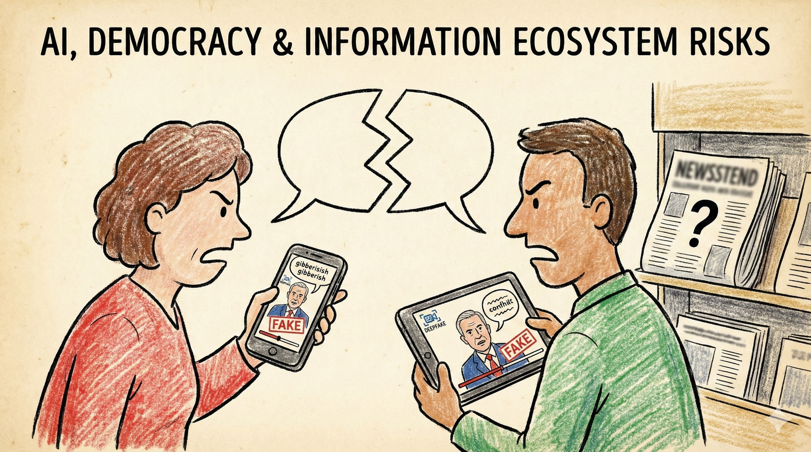

# Scenario 3: AI, Democracy & Information Ecosystem Risks

## Summary

By 2027, generative AI models can produce flawless video deepfakes, synthetic audio and persuasive written content at near-zero marginal cost. Political campaigns, advocacy groups and foreign actors use these tools to micro-target Australian voters on social media.

During the 2028 federal election campaign, a sophisticated deepfake video surfaces showing a major party leader making inflammatory remarks about Australian values. The video circulates on Facebook, WhatsApp and X. Within hours it has 3 million views. Australia's small fact-checking organisations scramble to verify it, but their debunks reach only a fraction of the audience—social media algorithms favour engagement over accuracy, and users in partisan bubbles rarely see corrections.

Then the counter-narratives begin: competing deepfakes, fake fact-checks, synthetic "eyewitness" accounts. By election day, voters in marginal electorates like Bass, Eden-Monaro and Gilmore have seen dozens of contradictory videos and can't tell what's real.

**The pattern repeats.** By 2031, sophisticated synthetic content floods every election cycle. Trust in ABC, Nine, News Corp and fact-checkers erodes as they're unable to verify content fast enough. Australians increasingly retreat to partisan information bubbles where AI-generated content reinforces existing beliefs.

When verification becomes impossible for most citizens and expensive for institutions, democracy itself is under strain.

!!! warning "This is a scenario, not a prediction"

    This scenario explores how AI-generated content could degrade trust in information and democratic processes. The specific timeline and incidents are illustrative—but the underlying capability (cheap, convincing synthetic media) already exists and is improving rapidly.

!!! info "Threat pathways"
    This scenario combines three pathways that degrade democratic processes:

    **Catastrophic misuse** – AI-powered information operations flood elections with synthetic content at scale

    **Power concentration** – Platform governance choices shape information environment more than democratic oversight

    **Gradual disempowerment** – Citizens lose ability to distinguish real from synthetic; trust in institutions erodes

---

## What Went Wrong: C·A·G·R Analysis

This scenario shows how AI-generated content degrades trust in information and democratic processes. The challenge is maintaining shared understanding of reality when verification becomes difficult and manipulation becomes easy.

=== ":lucide-shield-ban: Containment"

    Preventing the development of persuasive content generation capabilities proved difficult. Once models existed, jailbreaking and fine-tuning bypassed safety measures. Open-source models made content generation widely accessible. No effective way existed to contain synthetic media creation at scale.

=== ":lucide-target: Alignment"

    Models were optimised for engagement or persuasion, not for democratic health. Safety mitigations reduced obvious harms but missed aggregate, long-term effects on trust. Even "aligned" systems could be fine-tuned or prompted for manipulative purposes.

=== ":lucide-scale: Governance (Tested severely)"

    Electoral laws designed for human-paced campaigning proved inadequate for AI-generated content at scale. Platform governance choices shaped the information environment more than democratic processes—but platforms weren't accountable through democratic mechanisms. Attribution became nearly impossible: who created a deepfake? Which jurisdiction applies? Enforcement failed because manipulation techniques evolved faster than regulatory responses.

=== ":lucide-shield: Resilience (Primary failure mode)"

    Democracies depend on shared facts and norms of contestation—persistent manipulation and confusion weakened these foundations. Traditional verification methods couldn't keep pace with synthetic content generation. Media literacy and trusted local networks became critical infrastructure, but building them took years while erosion happened in months. Recovery required rebuilding epistemic security that had taken generations to establish.

---

## Questions for actors

Use these questions for risk assessments, strategic planning, and tabletop exercises.

=== ":material-bank: Government & Public Institutions"

    - What would you do if a convincing deepfake circulated 36 hours before an election? Who has authority to act? How fast could you respond?
    - How should electoral laws adapt when anyone can generate thousands of targeted messages at near-zero cost?
    - What verification mechanisms exist for official government communications?
    - What standards should apply to AI use in political communication?
    - How can public broadcasters and civic institutions support information resilience?

=== ":material-briefcase: Business & Industry"

    - **All organisations:** What's your crisis plan when a deepfake CEO video circulates?
    - **Platforms:** What can you detect now? What will become undetectable in 6-12 months?
    - **Media organisations:** How do you verify content when sophisticated fakes are indistinguishable from originals?
    - What verification infrastructure needs to exist across the media and technology ecosystem?
    - How can platforms balance free expression with preventing manipulation at scale?

=== ":material-account-group: Communities & Households"

    - What local trusted sources can you maintain that aren't mediated by social platforms?
    - What simple habits help: verify before sharing, check multiple sources, slow down on emotionally charged content?
    - How can communities strengthen media literacy without creating cynicism?
    - What role can local trusted institutions play in maintaining information quality?

---

!!! question "Can't we just use AI to detect AI-generated content?"

    **Detection is an arms race we're likely to lose:**

    - As generation improves, detection becomes harder
    - Adversaries can test content against detectors before release
    - Even 95% detection accuracy leaves millions of undetected fakes
    - Attribution (who created it) is often impossible

    **More promising approaches:**

    - Cryptographic authentication for official sources (what's real, not what's fake)
    - Media literacy and slower information consumption habits
    - Trusted local networks that aren't mediated by platforms
    - Institutional resilience so democracy functions even with degraded information

    **Key insight:** We can't out-detect the problem—we need resilience to information degradation.

---

## Why this scenario matters for Resilience and Governance

This scenario shows **epistemic security** as critical infrastructure—democracy depends on shared reality and the ability to distinguish truth from falsehood. When institutional trust erodes, verification becomes impossible. Trusted relationships that aren't mediated by platforms become critical, because we can't expect individuals to verify everything themselves.

---

??? note "Sources & Further Reading"
    This scenario draws from research on deepfakes, election integrity, synthetic media detection, and the challenges facing information ecosystems in democratic societies.

    **Australian precedents:** [Australian Electoral Commission](https://www.aec.gov.au/) disinformation monitoring · [RMIT FactLab](https://www.rmit.edu.au/about/schools-colleges/media-and-communication/industry/factlab) and [RMIT CrossCheck](https://www.rmit.edu.au/news/factlab/crosscheck) election fact-checking · [eSafety Commissioner](https://www.esafety.gov.au/) synthetic media regulatory considerations · [ABC Fact Check](https://www.abc.net.au/news/factcheck/)

    **Academic research:** Chesney & Citron (2019) ["Deep fakes: A looming challenge for privacy, democracy, and national security"](https://doi.org/10.17863/CAM.38952) · Wardle & Derakhshan (2017) ["Information disorder"](https://rm.coe.int/information-disorder-toward-an-interdisciplinary-framework-for-researc/168076277c) · Woolley & Howard (2018) *Computational Propaganda*

    **Policy organisations:** [Reset Australia](https://au.reset.tech/) · [First Draft News](https://firstdraftnews.org/) · [Centre for Responsible Technology](https://www.responsible.tech/) · [International Fact-Checking Network](https://www.poynter.org/ifcn/)

    **Case studies:** 2024 US and EU elections deepfake incidents · [Taiwan's approach to disinformation resilience](https://carnegieendowment.org/2024/02/08/taiwanese-model-for-generative-ai-governance-pub-91793) · Slovakia election deepfake (2023) · Indonesian election synthetic media (2024)

    **Key concepts:** See our [Concepts & Glossary](../concepts.md) for definitions of deepfakes, synthetic media, information operations, epistemic security and computational propaganda

---

