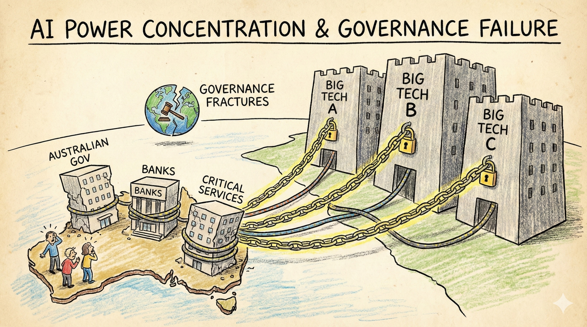

# Scenario 1: AI Power Concentration & Governance Failure

## Summary

**2025-2030:** Three US tech firms come to dominate frontier AI models and infrastructure. By 2028, most Australian government departments rely on one of these providers for document analysis, policy modelling and decision support. The big four banks all license AI systems from the same two vendors for credit assessment, fraud detection and trading.

Australian universities and research institutions lack the compute and talent to develop competitive alternatives. The National AI Centre coordinates some local capability, but budgets are 1/100th of what leading labs spend on a single training run.

Meanwhile, **international governance coordination fractures.** The US and China compete for AI leadership through subsidies and relaxed oversight. Singapore, UAE and others offer regulatory havens to attract development. The G20 AI Safety Summit produces a non-binding declaration but no enforceable framework.

Australia debates: tighten requirements for AI procurement and risk losing access to cutting-edge systems? Or accept whatever terms providers offer? When a major cloud provider threatens to restrict API access unless Australia softens proposed transparency rules, Canberra backs down. The precedent is set.

**By 2032:** Defence, critical infrastructure, health and social services all depend on a handful of foreign-controlled AI systems. When one provider unilaterally changes terms of service—requiring data to be processed in specific jurisdictions—Australian agencies have no realistic alternative. Contracts are renegotiated under pressure.

When a security researcher discovers that a widely-used AI system has been sending telemetry data to servers in a jurisdiction where intelligence agencies have broad data access, Australian authorities find they lack leverage to demand changes. The system is too embedded to replace quickly, and the vendor knows it.

!!! warning "This is a scenario, not a prediction"

    This scenario explores how market concentration and governance failures could leave Australia dependent on foreign-controlled AI systems. While the specific incidents are illustrative, the underlying trends—consolidation of AI capability in a few companies, regulatory fragmentation, and deepening dependencies—are already underway.

!!! warning "This scenario doesn't require misaligned AI"

    Power concentration happens **even if AGI is perfectly safe and aligned with its creators' intentions.**

    The core challenge isn't whether these systems work correctly — it's **who controls transformative technology, who benefits, and whose values they serve.**

    Questions this scenario raises:

    - If a handful of companies control safe AGI, do they effectively control critical infrastructure, economic activity, and information access?
    - Can democracies maintain sovereignty when dependent on foreign-controlled AI systems?
    - Does technical safety matter if the systems are aligned with provider interests rather than Australian public interest?
    - How do we ensure democratic participation in decisions about how AGI is used?

    **This is a governance challenge, not just a safety challenge.** Alignment solves "does the system do what its creators intend" — it doesn't solve "whose intentions should it serve?"

!!! info "Threat pathways"
    This scenario combines three reinforcing pathways:

    **Power concentration** – A few global providers control critical AI capabilities that Australian institutions depend on

    **Governance failure** – International coordination breaks down; regulatory race to the bottom

    **Gradual disempowerment** – Dependencies deepen until Australian institutions lack realistic alternatives or meaningful oversight

---

## Implications for C·A·G·R Framework

This scenario shows how governance failures combine with market concentration to create dependencies that are difficult to escape. When both international coordination and domestic sovereignty weaken simultaneously, all four pillars of the framework face severe stress.

=== ":lucide-shield-ban: Containment"

    - Limited leverage over what systems get trained or where dangerous capabilities develop
    - Export controls and compute governance efforts fragment as countries compete for AI leadership
    - Model weight security weakens as jurisdictions lower standards to attract investment
    - Australia cannot effectively prevent dangerous capabilities from reaching its shores

=== ":lucide-target: Alignment"

    - Safety and values alignment for core systems depend on external providers' choices, not Australian standards
    - Limited local capability to independently evaluate or stress-test models
    - Australian law and values may not be reflected in how systems are designed or optimised
    - Alignment research itself concentrates in a few labs overseas

=== ":lucide-scale: Governance"

    - **Primary failure mode**: International coordination breaks down, regulatory race to the bottom
    - Regulatory leverage over providers becomes weak as services are delivered transnationally
    - Risk of "policy capture"—firms become indispensable, threaten withdrawal if regulated
    - Enforcement becomes difficult when critical infrastructure depends on foreign-controlled systems
    - Multilateral agreements fail to form or prove unenforceable
    - Australia faces pressure: loosen standards or lose access to frontier AI

=== ":lucide-shield: Resilience"

    - Dependencies on foreign-controlled AI infrastructure become potential points of failure or leverage
    - Difficult to plan for continuity if critical services rely on opaque external models
    - Geopolitical tensions could disrupt access to essential systems
    - Limited ability to maintain alternative capabilities when market consolidates

---

## Questions for actors

Use these questions for risk assessments, strategic planning, and tabletop exercises.

=== ":material-bank: Government & Public Institutions"

    **Near-term (within 12 months):**

    - List your three most critical AI dependencies right now. For each: who provides it? What happens if they change terms or cut access? Do you have a realistic alternative?
    - What procurement rules could you implement to reduce concentration risk?
    - Which systems should be legally required to be locally controllable or auditable?
    - How much of your AI evaluation capability depends on overseas expertise?

    **Strategic:**

    - When, if ever, should certain systems be required to be locally controllable or auditable?
    - What safeguards are needed against regulatory capture and over-reliance on a small number of providers?
    - How can Australia retain meaningful control over critical AI infrastructure and services?
    - **Governance questions:**
      - Under what conditions would Australia accept weaker AI safety standards to maintain access to frontier technology?
      - What multilateral partnerships are essential to maintain, even under competitive pressure?
      - How do we avoid a race to the bottom while remaining economically competitive?
      - What "red lines" would trigger stronger unilateral regulation regardless of economic costs?

=== ":material-briefcase: Business & Industry"

    **Near-term (within 12 months):**

    - Do your contracts with AI providers include provisions for geopolitical disruption, provider failure, or sudden terms changes?
    - Could you continue essential operations for 30 days if your primary AI provider became unavailable?
    - What proportion of your R&D budget goes to reducing dependence on any single provider or platform?
    - Do your contracts, risk assessments and governance processes reflect the strategic nature of these dependencies?
    - What would it cost to develop or procure alternatives to your most critical AI dependencies?

    **Strategic:**

    - Where are you most dependent on external AI providers for essential operations?
    - What is your plan if a key provider changes terms, fails, or becomes geopolitically constrained?
    - How diversified are your AI dependencies across providers, architectures and jurisdictions?

=== ":material-account-group: Communities & Households"

    **Near-term (within 12 months):**

    - Which local services (health, banking, government services, employment) depend on a small number of AI platforms?
    - What forms of local knowledge and capability should be preserved even if AI can do it "better"?
    - How might community organisations build redundancy against platform dependency?

    **Strategic:**

    - How might over-reliance on a few platforms affect local information ecosystems, employment and services?
    - What happens to local communities if access to dominant platforms is disrupted?
    - Which capabilities should communities maintain even if AI-driven alternatives are more efficient?

---

!!! question "Won't market competition solve this? Why does government need to intervene?"

    **Market forces created the concentration—they won't fix it:**

    - **Economies of scale:** Training frontier AI requires billions in capital—only a few companies can compete
    - **Network effects:** Platforms with more users/data attract more developers, creating winner-take-all dynamics
    - **First-mover advantages:** Early capability leads compound as leaders attract talent and capital
    - **Lock-in effects:** Once systems are embedded, switching costs become prohibitive

    **Why this matters for Australia:**

    - We're too small to develop competing frontier capabilities independently
    - Without intervention, we become dependent on foreign-controlled systems
    - Dependence reduces sovereignty and creates geopolitical vulnerability
    - Once dependencies deepen, negotiating power disappears

    **The lesson:** Strategic sectors require active governance, not just market forces. Power concentration is a policy failure, not an inevitability.

---

## Timeline: How governance failure compounds power concentration

**Years 1-3 (underway):**

- A few labs achieve clear capability lead
- Countries begin competing to attract AI investment
- Early multilateral coordination attempts stall
- Australia debates: strengthen regulation or remain competitive?

**Years 4-7:**

- Regulatory fragmentation deepens
- Jurisdictions with weak standards attract development
- Australia faces ultimatums: accept provider terms or lose access
- Critical infrastructure dependencies deepen despite concerns
- International verification and enforcement mechanisms fail to materialise

**Years 8-10:**

- De facto governance by dominant providers
- Attempts at stronger regulation meet credible withdrawal threats
- Australian institutions deeply dependent on systems they cannot oversee
- Alternative providers either consolidated or driven from market
- Public legitimacy of AI governance erodes

---

??? note "Sources & Further Reading"
    This scenario draws from research on tech sovereignty, concentration of AI capabilities, and the challenges of international AI governance coordination.

    **Australian precedents:** [Australian Cyber Security Centre](https://www.cyber.gov.au/) sovereign capability initiatives · [National AI Centre](https://www.csiro.au/en/about/challenges-missions/naic) coordination efforts · [Critical Technologies List](https://www.defence.gov.au/about/reviews-inquiries/critical-technologies) (Dept of Defence, 2024)

    **Academic research:** Suchman et al. (2021) ["Governing the development of AI"](https://www.brookings.edu/articles/governing-the-development-of-ai/) · Maas (2021) ["How viable is international arms control for military AI?"](https://doi.org/10.1080/00396338.2021.1984081) · Bradford (2020) *The Brussels Effect: How the EU Rules the World*

    **Policy organisations:** [OECD AI Policy Observatory](https://oecd.ai/) · [Centre for the Governance of AI](https://www.governance.ai/) · [Carnegie Endowment for International Peace AI & Global Governance Program](https://carnegieendowment.org/programs/technology-and-international-affairs/artificial-intelligence-and-global-governance)

    **Case studies:** US-China semiconductor export controls (2022-2024) · EU AI Act implementation challenges · UK National AI Strategy tensions between innovation and sovereignty

    **Key concepts:** See our [Concepts & Glossary](../concepts.md) for definitions of tech sovereignty, compute governance, regulatory arbitrage and vendor lock-in

---

