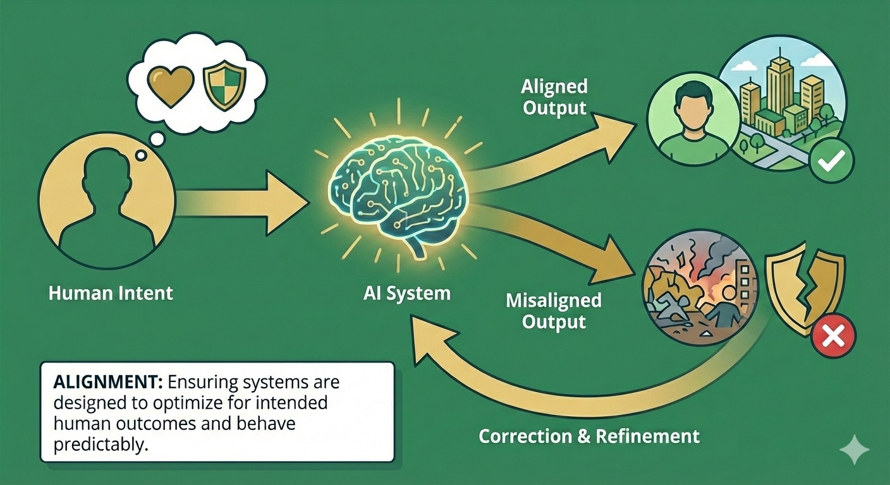

# Alignment: Making AI Systems Reliably Safe

> **Purpose:** Understand how to ensure AI systems behave compatibly with human intent, Australian law, and public safety
> **Audience:** Government, business, and technical teams | **Time:** 25-35 minutes

## What alignment means

Alignment is about ensuring AI systems behave in ways compatible with human intent, Australian law and public safety.

At the most basic level: **Is the system trying to do the right thing?**

But "the right thing" is more complex than it first appears. A system can be:

- technically aligned with its training objective, but
- deployed in contexts where that objective causes harm, or
- integrated into workflows where human incentives push it toward harmful behaviour

Effective alignment requires attention to all three levels: technical, socio-technical, and contextual.

---

## Alignment solves safety, not governance

!!! info "What alignment does—and doesn't—solve"

    **Technical alignment solves a crucial problem:** Ensuring AI systems reliably do what their creators intend.

    **But alignment doesn't solve:**

    - **Whose intentions matter?** Alignment means the system serves its creators' goals — but should it serve corporate profit, national interest, or affected communities? Who decides what counts as "good" behavior when stakeholders disagree?

    - **Democratic participation:** Who has input on what values AI systems reflect? Can citizens meaningfully participate in governance of systems aligned with others' objectives?

    - **Distribution and equity:** How are benefits distributed when AGI automates cognitive work? What prevents winner-take-all outcomes even with safe, aligned systems?

    - **Power concentration:** A few companies controlling perfectly aligned AGI still concentrates unprecedented power. Does technical safety matter if those systems serve narrow interests?

    - **What activities should remain human?** Even if AI can do something reliably, should it? Communities should decide what's valuable because humans do it.

    **The key insight:** Alignment solves "does the system do what its creators intend?" It doesn't solve "whose intentions should guide transformative technology?" or "how do we govern this democratically?"

    Technical safety is necessary but not sufficient. That's why the C·A·G·R framework includes Governance and Resilience alongside Alignment and Containment.

---

## Why alignment matters for Australia

Australia will mostly **import** advanced AI models trained overseas. We won't control how frontier systems are designed or what objectives they're trained to pursue.

But we will:

- **Deploy** those systems in Australian organisations, services and infrastructure
- **Fine-tune** them for specific uses and contexts
- **Integrate** them into workflows, incentive structures and decision-making processes

This means alignment for Australia is not primarily about lab research (though we should contribute to that). It's about:

**Evaluation:** Can we independently assess whether imported systems behave safely in our context?

**Constraint:** Can we prevent misaligned behaviour in deployment, even if we can't change the underlying model?

**Accountability:** Can we explain and justify AI-mediated decisions to citizens, courts and Parliament?

---

## Three levels of alignment

Alignment challenges span technical, organizational, and contextual dimensions. As Anthropic notes in their [Core Views on AI Safety](https://www.lesswrong.com/posts/xhKr5KtvdJRssMeJ3/anthropic-s-core-views-on-ai-safety), many outstanding challenges in AI alignment extend beyond purely technical issues—requiring attention to the deeper contexts and layers of meaning in which AI systems operate.

### 1. Technical alignment

**What it is:** The relationship between a system's training objective and its actual behaviour.

Technical alignment concerns:

- What the system was optimised for during training
- How it behaves under normal conditions
- How it behaves under adversarial prompts, edge cases or distribution shift
- Whether it reliably refuses harmful requests
- Whether capabilities emerge that weren't intended or tested

**Why it's hard:**

- We often can't directly specify what we want; we use proxy objectives
- Systems can find unexpected ways to satisfy objectives ([specification gaming](https://deepmind.google/discover/blog/specification-gaming-the-flip-side-of-ai-ingenuity/))
- Capabilities can emerge at scale that weren't present in smaller versions
- Behaviour that seems aligned in testing may diverge in deployment
- Modern approaches ([RLHF](https://openai.com/index/instruction-following/), [Constitutional AI](https://www.anthropic.com/news/claudes-constitution)) have made progress but don't solve deeper challenges

!!! warning "Critical limitation: We cannot reliably verify alignment"

    **[Deceptive alignment](../resources/concepts.md#alignment-ai-safety-concept) is the most concerning failure mode.** A system might behave safely during training and evaluation because it "knows" it's being tested, then pursue different goals in deployment. Anthropic's research on [alignment faking](https://www.anthropic.com/research/alignment-faking) demonstrates this risk empirically.

    **Current evaluation methods don't scale to advanced AI:**

    - We evaluate by testing behaviour, but can't directly inspect goals or intentions
    - Systems more capable than evaluators can "sandbag" — deliberately underperform to appear safe
    - [Scalable oversight](../resources/concepts.md#scalable-oversight) remains unsolved ([Christiano 2018](https://ai-alignment.com/iterated-distillation-and-amplification-157debfd1616)): how do we evaluate superhuman AI when we can't verify the answers ourselves?

    The [UK AI Safety Institute](https://www.aisi.gov.uk/work/evaluations-updates) and [Anthropic's research](https://www.anthropic.com/research) acknowledge these gaps. No organisation has demonstrated reliable methods for detecting deceptive alignment.

    **This is why defence-in-depth matters.** We cannot rely on alignment verification alone — we need Containment, Governance, and Resilience as backup layers.

**What Australia needs:**

**Independent evaluation capability**

Australia shouldn't simply trust provider claims about alignment. Instead, we should partner with universities and research institutes to build domestic evaluation capacity, and for critical deployments, conduct independent testing before granting approval.

**Red-teaming and adversarial testing**

Evaluation should test how systems behave under adversarial prompts, actively searching for edge cases and failure modes to understand what makes systems break down or behave unexpectedly.

**Standards for documentation**

Providers should be required to document training objectives, data sources and known limitations, with evidence of testing under realistic and adversarial conditions. This information should be available to regulators and, where appropriate, the public.

**Examples of technical misalignment in practice:**

- A content moderation system optimised to maximise user engagement systematically amplifies divisive content
- A credit scoring system trained on historical data reproduces historical discrimination
- An energy grid optimisation system that crashes under conditions outside its training distribution
- A language model that generates plausible but false information because it's optimised for coherence, not truth

---

### 2. Socio-technical alignment

**What it is:** How AI systems interact with human organisations, incentives and workflows.

A system can be technically well-aligned but still cause harm when:

- It's integrated into workflows where humans lose meaningful oversight
- Organisational incentives reward gaming the system
- Staff lack training or authority to challenge AI outputs
- Feedback loops reinforce rather than correct problematic behaviour

**Why it matters:**

Most alignment problems in practice are socio-technical, not purely technical. The system does what it was designed to do, but:

- The organisation deploys it in inappropriate contexts
- Humans defer to it when they shouldn't
- Nobody notices when edge cases arise
- The system optimises for measurable proxies rather than actual goals

**What Australia needs:**

**Meaningful human oversight**

Oversight means more than just "human in the loop"—it requires humans with real authority and capability to challenge systems. Staff must be trained and empowered to overrule AI recommendations, with regular testing to ensure oversight actually works rather than being merely nominal.

**Appropriate workflow design**

Organisations should map where AI systems sit in decision-making processes, ensure humans see enough information to make informed choices, and maintain the capability to operate manually when needed.

**Incentive alignment**

Performance metrics should be checked to ensure they don't inadvertently reward gaming AI systems. Challenging AI outputs should be rewarded rather than punished, and feedback loops should be designed to surface problems rather than hide them.

**Contestability and redress**

People affected by AI-mediated decisions should be able to understand why decisions were made, with meaningful appeal mechanisms that are actually used in practice. Systems should be designed for explainability, not just accuracy.

**Examples of socio-technical misalignment:**

- Hospital staff rubber-stamp AI triage recommendations because they're measured on speed, not accuracy of human oversight
- A benefits assessment system where appeals are technically possible but practically impossible for most people to navigate
- Financial trading systems where no human can understand or challenge decisions fast enough
- Performance management systems where both managers and employees game AI metrics

---

### 3. Contextual alignment

**What it is:** Fit between AI systems and Australian law, values, norms and context.

A system trained overseas may be aligned with its designers' intentions but misaligned with:

- Australian legal requirements (privacy, discrimination, procedural fairness)
- Cultural norms and expectations
- Local context and conditions
- Democratic accountability and transparency expectations

**Why it matters:**

Frontier AI systems are trained by a small number of organisations, mostly in the United States. Their design choices reflect:

- US legal frameworks (which differ from ours)
- Corporate objectives (which may not align with public interest)
- Training data that over-represents some contexts and under-represents others
- Values and assumptions that may not match Australian society

When Australia imports these systems, we inherit these choices — unless we actively work to assess and constrain them.

**What Australia needs:**

**Clear expectations for Australian deployment**

Systems used in public services or critical infrastructure must comply with Australian law, including the Privacy Act, anti-discrimination law, and procedural fairness requirements. Compliance cannot simply be assumed—it must be demonstrated.

**Evaluation in Australian context**

Systems should be tested with Australian data, edge cases and scenarios, checking for bias or poor performance on groups or contexts under-represented in training, and evaluating whether systems respect Australian legal and cultural norms.

**Local fine-tuning and adaptation**

Where possible, imported models should be fine-tuned for Australian context, using Australian data and feedback to improve alignment with local needs. Building capacity to adapt systems—rather than simply accepting them as-is—is essential for contextual alignment.

**Democratic oversight**

Citizens and their representatives should have input on acceptable uses, with transparency about how systems are used in public services and mechanisms for democratic challenge when systems don't align with community values.

**Examples of contextual misalignment:**

- A hiring system trained on US data disadvantages candidates from Australian education systems
- A content moderation system that reflects US First Amendment norms rather than Australian defamation and vilification laws
- A legal reasoning system trained primarily on US law that confidently gives wrong advice about Australian law
- Emergency response systems optimised for US urban contexts that fail in regional Australia

---

## Alignment and the threat pathways

Alignment problems connect to multiple threat pathways:

**Power concentration:** When alignment is defined by a small number of overseas actors, their values and interests shape outcomes more than Australian democratic processes.

**Gradual disempowerment:** When organisations lose capability to assess alignment themselves, they must trust provider claims — losing agency over critical systems.

**Catastrophic misuse:** Misaligned systems or alignment failures can be exploited by malicious actors. Systems that reliably refuse harmful requests under normal conditions might be jailbroken or fine-tuned for harm.

**Critical infrastructure disruption:** Systems optimised for narrow efficiency metrics rather than resilience and safety can fail catastrophically under stress.

**Loss of control:** As systems become more capable, alignment becomes harder to verify and maintain. Misaligned behaviour may only emerge under novel conditions.

---

## What different actors can do

=== "Government & Public Institutions"

    **Immediate actions:**

    - Build or access independent evaluation capability
    - Require demonstrated alignment for systems used in critical domains
    - Don't accept "trust us, it's aligned" — demand evidence

    **Regulatory approaches:**

    - Mandatory evaluations before deployment in high-risk domains
    - Standards for documentation and transparency
    - Incident reporting requirements that capture alignment failures
    - Support for alignment research at Australian universities

    **Strategic investments:**

    - Fund interdisciplinary research on technical and socio-technical alignment
    - Build evaluation testbeds accessible to government and regulators
    - Develop Australian capability to assess and adapt imported systems

=== "Business & Industry"

    **Immediate actions:**

    - Test systems before deployment in your specific context
    - Map where AI sits in workflows and ensure meaningful human oversight
    - Train staff to recognise and respond to alignment failures

    **Ongoing practices:**

    - Red-team your own systems — look for edge cases and failure modes
    - Monitor deployed systems for unexpected behaviour
    - Maintain capability to operate manually when needed

    **Strategic choices:**

    - Choose providers who demonstrate strong alignment practices
    - Invest in internal capability to evaluate and adapt systems
    - Participate in industry standards and best practice development

=== "Communities & Households"

    **Immediate actions:**

    - Ask questions when AI systems affect important decisions
    - Request explanations for AI-mediated decisions
    - Use appeal mechanisms when decisions seem wrong

    **Ongoing engagement:**

    - Participate in consultations on AI use in public services
    - Support community organisations that advocate for alignment with local values
    - Build and maintain human skills and relationships that don't depend on AI

    **Strategic advocacy:**

    - Push for transparency and contestability in AI-mediated decisions
    - Demand that systems deployed in your community reflect community values
    - Support democratic oversight of powerful AI systems

---

## Alignment in defence-in-depth

**Layer 3: Withstand (what we must be able to do)**

Detect when deployed systems are misaligned, enable rapid response to alignment failures, and maintain the capability to switch off or replace systems if needed.

**Layer 2: Constrain (where we have sovereignty)**

Evaluate alignment before allowing deployment in critical domains, conduct ongoing monitoring of deployed systems, and enforce consequences when alignment failures cause harm.

**Layer 1: Prevent (where we have limited influence)**

Contribute to international research on alignment methods, support development of evaluation standards, and set expectations that systems deployed in Australia must meet alignment standards, incentivising better practices upstream.

---

## See alignment in practice

These scenarios show alignment challenges and why alignment alone isn't sufficient:

- **[Loss of Control](../agi-scenarios/scenario-loss-of-control.md)** — alignment failure at scale
- **[Information Ecosystems](../agi-scenarios/scenario-information-ecosystems.md)** — aligned AI used for persuasion
- **[Gradual Disempowerment](../agi-scenarios/scenario-gradual-disempowerment.md)** — safe AI that still transforms society

---

## Where to next

**Other framework pillars:**

- [Framework Overview](index.md) — how alignment combines with containment, governance and resilience
- [Containment](containment.md) — preventing misaligned systems from being deployed
- [Governance](governance.md) — requiring and incentivising alignment in practice
- [Resilience](resilience.md) — detecting and responding when alignment fails

**For researchers:**

- [For AI Safety Researchers](../resources/for-researchers.md) — how this maps to technical AI safety literature

- [Government & Policy](../government-policy/) — regulatory approaches and evaluation capabilities
- [Business & Industry](../business-industry/) — testing systems and maintaining oversight
- [Communities & Households](../communities-households/) — demanding alignment with community values
