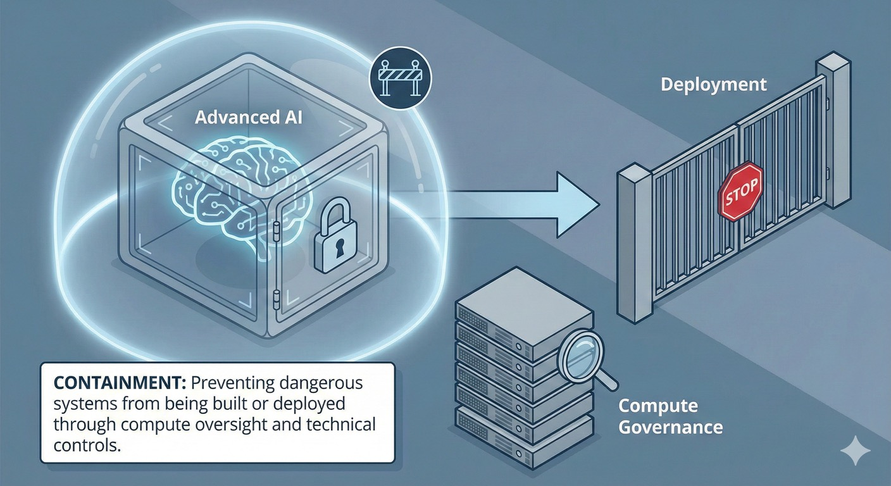

# Containment: Preventing Dangerous AI Systems

> **Purpose:** Understand how to prevent dangerous AI systems through compute governance, AI control, and deployment restrictions
> **Audience:** Government, business, and critical infrastructure operators | **Time:** 20-30 minutes

## What is containment?

**Containment** is about stopping dangerous AI systems before they cause harm. This means:

1. **Preventing dangerous systems from being built** in the first place (Layer 1)
2. **Restricting deployment** of high-risk systems that do get built (Layer 2)
3. **Maintaining technical controls** over powerful AI systems to limit what they can do

Containment is the first line of defence. If we can prevent the most dangerous AI capabilities from being created or deployed, we don't need to rely solely on alignment, governance or resilience to protect us.

---

## Why containment matters

Some AI capabilities are inherently dangerous—not because they're misaligned, but because the capability itself creates unacceptable risks if it exists at all or is widely accessible.

Examples:

- AI systems that can autonomously develop novel bioweapons
- Systems that can find and exploit zero-day vulnerabilities faster than defenses can adapt
- Highly capable systems that might be impossible to monitor or shut down once deployed

[Australian AI safety experts validate these priorities](https://www.goodancestors.org.au/our-work/ai-safety/aisi-expert-survey): 85.8% rated autonomous systems as very important/critical, 81.2% prioritized cyber misuse risks, and 79.8% highlighted dual-use science and CBRN threats.

For these cases, **prevention is more tractable than mitigation**. It's easier to prevent a dangerous system from being created than to defend against it once it exists.

### The containment challenge

Australia faces an asymmetric containment problem:

- Most frontier AI training happens overseas (primarily US, China, UK)
- We have limited leverage over what systems get trained
- But we have significant influence over:

  - Compute supply chains (hardware, data centres)
  - What systems can be deployed in Australia
  - Procurement requirements for government and critical infrastructure
  - International norms and partnerships

Containment is about maximising leverage where we have it, while contributing to international efforts where we don't.

---

## Two types of containment: Prevention vs Control

Containment operates at two distinct stages:

!!! info "Prevention vs AI Control"

    **Prevention (Layer 1):** Stop dangerous systems from being built or deployed

    - Compute governance — limit access to training infrastructure
    - Export controls — prevent hardware/models reaching adversaries
    - Licensing — require approval before high-risk deployment

    **AI Control (Layer 2):** Constrain systems that already exist but might be misaligned

    - This is distinct from [alignment](../resources/concepts.md#alignment-ai-safety-concept) (making systems want the right thing)
    - [AI control methods](../resources/concepts.md#ai-control-technical-concept) assume systems might be dangerous and build technical walls anyway
    - Monitoring, usage restrictions, shutdown capability, red-teaming

    **Why both matter:** Prevention is ideal but won't catch everything. Control provides backup when prevention fails or systems reveal dangerous capabilities post-deployment.

---

## Four containment strategies

### 1. Compute governance

**What it is:** Oversight of the physical infrastructure (chips, data centres, compute clusters) used to train and run powerful AI systems. CSET's [compute governance framework](https://cset.georgetown.edu/article/governing-compute-a-primer/) explains how hardware chokepoints enable oversight.

**Why it matters:** Training frontier AI systems requires massive amounts of specialised computing hardware. Unlike software (which can be copied instantly), advanced AI chips and data centres are:

- Expensive and difficult to produce
- Concentrated in a small number of supply chains
- Physically trackable

This makes compute a practical chokepoint for oversight.

!!! warning "Compute governance limitations"
    Compute governance is not a complete solution:

    - **Algorithmic efficiency:** Better algorithms can reduce compute requirements, making oversight harder
    - **Open-source proliferation:** Open model weights can be run on distributed hardware
    - **Hardware advancement:** Smaller actors may eventually access sufficient compute

    Compute governance is most effective as part of defence-in-depth, not a standalone solution.

**Key approaches:**

**Supply chain controls**

- Track sales and deployment of advanced AI chips (GPUs, TPUs, specialised accelerators)
- Know where large compute clusters exist and what they're being used for
- Export controls to prevent advanced chips reaching adversaries or reckless actors

**Data centre oversight**

- Registration requirements for facilities above certain compute thresholds
- Reporting requirements for very large training runs
- Ability to audit or inspect high-risk training operations

**Australian context**

Australia hosts some significant data centres but isn't a major chip manufacturer. Our leverage comes through requiring reporting for large-scale compute used in Australia, setting procurement standards for government and critical infrastructure, supporting allies' compute governance efforts (especially US chip export controls), and demanding evidence about training methods for models deployed here.

---

### 2. AI control methods

**What it is:** Technical measures to monitor, restrict and contain AI systems that are already trained but potentially dangerous. The [AI control approach](https://www.lesswrong.com/posts/kcKrE9mzEHrdqtDpE/the-case-for-ensuring-that-powerful-ais-are-controlled) (Greenblatt & Shlegeris, Redwood Research) assumes systems might be misaligned and builds constraints anyway.

**Why it matters:** Some systems will be trained despite Layer 1 prevention efforts. AI control methods provide a second layer—technical "walls" around dangerous systems to limit what they can do, even if they're not perfectly aligned.

This is distinct from *alignment* (making systems want to do the right thing). Control assumes systems might be misaligned or deceptive, and builds technical constraints anyway.

**Key approaches:**

**Monitoring and oversight**

AI control requires continuous logging of system inputs, outputs and internal states, combined with anomaly detection to flag suspicious behaviour. This includes deploying "honeypots" and deception tests to detect goal misalignment, while maintaining multiple independent monitoring systems—never relying on AI to monitor itself.

**Usage restrictions**

Effective containment includes rate limiting and access controls, restricting what resources systems can access (networks, APIs, actuators), and "air-gapping" dangerous systems from the internet and critical infrastructure. High-stakes decisions or actions should require explicit human approval before execution.

**Shutdown capability**

Organisations must maintain the ability to shut down systems quickly through "kill switches" that cannot be circumvented by the AI itself. This requires multiple independent shutdown mechanisms and regular testing of shutdown procedures—not just theoretical plans but proven, practiced capability.

**Red-teaming and adversarial testing**

Before deployment, systems should face deliberate attempts to make them misbehave, testing whether they can circumvent restrictions and checking for deceptive behaviour—systems that act aligned during testing but might pursue different goals in deployment.

**Australian context**

AI control is where Australia has real leverage—we can require these measures as a condition of deployment. Critical infrastructure operators and government agencies should demand evidence that appropriate AI control methods are in place, backed by independent verification rather than provider assurances alone, with regular testing and updates as systems and threats evolve.

---

### 3. Export controls and supply chain security

**What it is:** Preventing advanced AI capabilities (and the means to create them) from reaching adversaries, reckless actors or unstable regions.

**Why it matters:** Australia's security depends partly on maintaining technological advantage and preventing hostile actors from acquiring the most dangerous capabilities. Even for non-hostile actors, we want to ensure systems are developed responsibly.

**Key approaches:**

**Hardware export controls**

- Restrict export of advanced AI chips to countries of concern
- Multilateral coordination (esp. with US, allies) on chip restrictions
- Balance security with legitimate international research collaboration

**Model weight security**

- Treat advanced [model weights](https://www.rand.org/pubs/research_reports/RRA2849-1.html) (the trained parameters of frontier AI) as sensitive assets
- Prevent theft or unauthorized release
- Understand that once weights leak, containment becomes much harder

**Know-your-customer requirements**

- Cloud providers and compute vendors should verify who's using large-scale compute and for what purpose
- Red flags: unusual access patterns, attempts to obfuscate identity or purpose

**Australian context**

Australia isn't a chip manufacturer, but we're part of allied supply chains and benefit from US export controls, which we should actively support. We can set security requirements for compute providers operating in Australia and contribute to multilateral efforts on model weight security.

---

### 4. Licensing and safety evaluations

**What it is:** Requiring permission before deploying high-risk AI systems, conditional on demonstrating safety properties.

**Why it matters:** Not all AI systems are equally risky. Licensing allows proportionate oversight:

- Low-risk systems: light touch or self-regulation
- High-risk systems (critical infrastructure, public safety, national security): mandatory evaluation and approval
- Frontier systems with dangerous capabilities: stringent requirements, possibly pre-deployment approval

**Key approaches:**

**Risk-based thresholds**

Define what counts as "high-risk" or "frontier" based on:

- Capabilities (cyber, bio, persuasion, autonomous action)
- Deployment context (critical infrastructure, public services, sensitive domains)
- Scale and autonomy

**Mandatory evaluations**

Before deployment, require evidence of:

- Safety properties and alignment testing
- Robustness to adversarial inputs
- Bias and fairness audits for relevant domains
- Appropriate AI control measures
- Incident response and shutdown procedures

**Independent evaluation**

- Don't rely solely on developer assurances
- Build Australian evaluation capacity or recognise international evaluation bodies
- Consider whether Australian AI Safety Institute should play an evaluation role

**Ongoing monitoring**

- Licensing isn't one-time: systems change, are fine-tuned, or reveal new capabilities
- Require ongoing reporting and re-evaluation triggers

**Australian context**

This is where Australia has clear sovereignty—our laws govern what's deployed here. We can learn from emerging international models (UK, EU, US state-level) while tailoring to Australian needs, balancing safety with avoiding over-regulation of low-risk systems. Procurement provides immediate leverage: government won't buy systems that don't meet standards.

---

## Who does what: containment across actors

=== "Government & Public Institutions"

    **Set the rules:**

    - Develop compute governance framework (reporting, registration, oversight)
    - Create risk-based licensing regime for high-risk and frontier AI
    - Set evaluation standards and processes
    - Support allied export control efforts

    **Build capacity:**

    - Fund evaluation capability (possibly through Australian AI Safety Institute)
    - Maintain expertise in AI control methods and red-teaming
    - Track international best practice

    **Lead by example:**

    - Require stringent containment measures for government procurement
    - Apply high standards to critical infrastructure
    - Support international coordination on compute governance

=== "Business & Industry"

    **Implement AI control methods:**

    - Don't just trust provider claims—verify that appropriate monitoring, restrictions and shutdown capability exist
    - Test systems adversarially before deployment
    - Maintain audit trails and anomaly detection

    **Comply with licensing and reporting:**

    - Understand which regulations apply to your systems
    - Engage early with regulators if deploying high-risk AI
    - Report incidents and near-misses honestly

    **Secure your systems:**

    - Treat model weights and advanced systems as sensitive assets
    - Verify compute providers and cloud services are trustworthy
    - Implement know-your-customer for services that provide AI access

    **Critical infrastructure operators:**

    - Apply defence-in-depth: don't rely solely on AI alignment
    - Maintain ability to operate without high-risk AI if containment fails
    - Participate in information sharing on threats and failures

=== "Communities & Households"

    **Limited direct role in containment, but:**

    - Understand that not all AI capabilities should be widely available
    - Support appropriate regulation even if it limits some uses
    - Advocate for transparency about what systems are being deployed in critical domains (health, public services, etc.)

---

## Common questions

**"Isn't containment the same as governance?"**

No. Containment includes technical measures (AI control methods, monitoring systems) and preventive measures (compute governance, export controls) that are distinct from laws and institutions. Governance creates the rules; containment includes both the rules and the technical enforcement.

**"Won't compute governance and export controls just drive AI development underground or offshore?"**

Possibly, but:
1. Frontier AI training requires massive, visible compute infrastructure—it's hard to hide
2. Export controls can be effective if coordinated among allies who control chip supply chains
3. The alternative (no oversight) means we have zero visibility and zero leverage
4. We can balance security with legitimate international research collaboration

**"Can AI control methods really contain a sufficiently advanced AI?"**

Maybe not indefinitely, especially for superintelligent systems. That's why containment includes Layer 1 (preventing dangerous systems from being built). For advanced but not superintelligent systems, AI control provides meaningful protection. For superintelligent systems, prevention becomes paramount—if we can't prevent them, we're relying heavily on alignment.

**"Won't licensing slow down innovation?"**

Risk-based licensing shouldn't burden low-risk systems. The goal is proportionate oversight: stringent for dangerous capabilities and critical deployments, light-touch elsewhere. Innovation in low-risk domains continues; high-risk domains get appropriate scrutiny.

---

## See containment in practice

These scenarios illustrate containment challenges and what happens when it succeeds or fails:

- **[Loss of Control](../agi-scenarios/scenario-loss-of-control.md)** — what containment aims to prevent
- **[Catastrophic Misuse](../agi-scenarios/scenario-catastrophic-misuse.md)** — containment of dangerous capabilities
- **[Power Concentration](../agi-scenarios/scenario-power-concentration.md)** — why containment needs governance

---

## Where to next

**Other framework pillars:**

- [Framework Overview](index.md) — how containment fits with alignment, governance and resilience
- [Alignment](alignment.md) — making systems safe by design, even when containment fails
- [Governance](governance.md) — laws and institutions to implement containment measures
- [Resilience](resilience.md) — withstanding failures when containment doesn't prevent them
