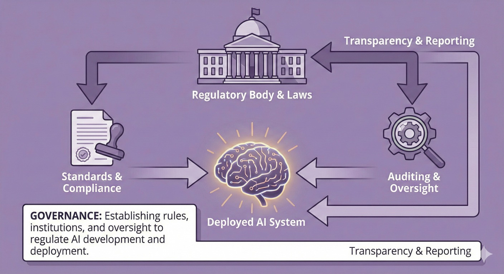

# Governance: Laws, Institutions and Coordination

> **Purpose:** Understand how laws, institutions, and coordination shape safe AI development and deployment
> **Audience:** Government, policy makers, regulators, and business leaders | **Time:** 25-35 minutes

## What is governance?

**Governance** is about the laws, institutions, standards and coordination mechanisms that shape how AI is developed, deployed and used. This includes:

1. **Regulatory frameworks** that define rules and consequences
2. **Institutions** with clear mandates and enforcement powers
3. **Transparency and accountability** mechanisms
4. **International coordination** to avoid races and address shared risks

Governance provides the social and legal infrastructure for containment, alignment and resilience. Even well-aligned systems with good technical controls need governance to ensure they're deployed appropriately and harms are addressed when they occur.

---

## Governance: The challenge beyond safety

!!! tip "Why governance matters even if AGI is perfectly safe"

    **Technical alignment solves one class of problems.** Ensuring AI systems reliably do what their creators intend is crucial — but it doesn't answer the deeper questions:

    - **Democratic participation:**
      Who decides how powerful AI systems are used? Do communities have input on what values AI reflects? Can citizens meaningfully participate in governance of transformative technology?

    - **Distribution and equity:**
      How are productivity gains distributed? Who benefits from AI-enabled growth? How do we prevent winner-take-all outcomes?

    - **Power and control:**
      What prevents concentration of control in a few companies or nations? How do democracies maintain sovereignty when dependent on foreign AI systems? Can institutions govern systems more capable than human experts?

    - **Legitimacy and values:**
      Whose values should AI systems reflect — creators, deployers, or affected communities? How do we ensure AI serves public interest, not just private profit? What activities should remain human even if AI can do them?

    **Even perfectly aligned AGI — that reliably does what its creators intend — requires governance to answer these questions.** Technical safety is necessary but not sufficient for beneficial outcomes.

---

## Why governance matters

### The governance gap

AI capabilities are advancing faster than our governance systems. Most existing laws weren't designed for:

- Systems that can act autonomously at scale
- Capabilities that emerge unpredictably during training
- Global supply chains where training, deployment and impacts span jurisdictions
- Dual-use technologies where beneficial and harmful uses are inseparable

**The result:** Regulatory uncertainty, accountability gaps, and a risk that deployment is driven by commercial or geopolitical incentives rather than safety.

### What good governance achieves

- :material-file-check: **Clarifies responsibilities**

    ---

    Who approves deployment of high-risk systems? Who's liable when things go wrong? What standards must be met?

- :material-timeline-check: **Provides predictability**

    ---

    Developers and deployers know what's required. Innovation can proceed within clear guardrails. Reduces regulatory arbitrage (racing to weakest jurisdiction).

- :material-account-check: **Enables accountability**

    ---

    Transparency requirements make behaviour visible. Enforcement mechanisms create consequences for violations. Learning from incidents improves future practice.

- :material-earth: **Coordinates across borders**

    ---

    Prevents dangerous races to build capabilities first. Enables information sharing about risks and failures. Builds common standards and mutual recognition.

---

## Five governance priorities

### 1. Regulatory frameworks and standards

**What it is:** Laws, regulations and standards that define acceptable AI development and deployment practices.

**Key elements:**

**Risk-based regulation**
Not all AI systems need the same level of oversight. A proportionate framework:

- **Minimal risk:** General-purpose tools, low-stakes uses—light-touch regulation or self-regulation
- **High risk:** Systems in critical infrastructure, public safety, justice, health—mandatory requirements, evaluation, ongoing monitoring
- **Frontier systems:** Systems with potentially dangerous capabilities (advanced cyber, bio, deception, autonomous operation)—stringent pre-deployment approval, containment requirements

International frameworks like the [US NIST AI Risk Management Framework](https://www.nist.gov/itl/ai-risk-management-framework), [EU AI Act](https://artificialintelligenceact.eu/), and [UK approach to AI regulation](https://www.gov.uk/government/publications/ai-regulation-a-pro-innovation-approach) provide models, though Australia must tailor to our context and capabilities

**Mandatory requirements for high-risk systems**

- Safety evaluations before deployment
- Bias and fairness audits for relevant domains
- Human oversight for critical decisions
- Incident reporting and transparency obligations
- Ongoing monitoring and re-evaluation triggers

**Standards and certification**

- Technical standards for safety, robustness, interpretability
- Certification schemes (possibly tiered based on risk)
- Mutual recognition with trusted international partners

**Australian context:**

- Australia is developing AI regulatory frameworks through voluntary guidance and new institutions—see our [AI Standards & Legislation](../../safety-standards/index.md) section for current status including the Voluntary AI Safety Standard (10 Guardrails), Guidance for AI Adoption (AI6), and the new AI Safety Institute
- The [National AI Plan](../../safety-standards/ai-australian-legislation.md) (December 2025) sets Australia's current approach: relying on existing laws plus voluntary guidance, supported by the AI Safety Institute from 2026
- We can learn from international approaches (EU AI Act, UK pro-innovation framework, US state-level) while tailoring to Australian needs
- Procurement provides immediate leverage: government can require standards before buying

---

### 2. Clear institutional roles and mandates

**What it is:** Ensuring government bodies and regulators have clear responsibilities, authority and resources for AI governance.

**The challenge:**

AI cuts across many domains (health, finance, critical infrastructure, defence, consumer protection). No single regulator "owns" AI safety. Without clarity, we get:

- Gaps (no one responsible)
- Overlaps (multiple agencies, unclear authority)
- Under-resourcing (everyone assumes someone else will handle it)

**Key institutional elements:**

**Lead coordination body**
A body (possibly within Treasury, Home Affairs, or as independent agency) that:

- Coordinates AI policy across government
- Provides expertise and guidance to sectoral regulators
- Monitors international developments and ensures Australia keeps pace
- Maintains relationships with international partners

**Sectoral regulators with AI mandates**
Existing regulators (ACCC, ACMA, APRA, TGA, etc.) need:

- Explicit mandates to address AI risks in their domains
- Technical expertise and resources
- Coordination mechanisms to address cross-cutting issues

**Evaluation and assurance capability**
Possibly through Australian AI Safety Institute:

- Evaluate frontier and high-risk systems
- Develop evaluation methodologies
- Provide independent assurance (not just trusting developer claims)
- Support incident analysis and learning

**Research and horizon scanning**
Funding and mandate for:

- Understanding emerging capabilities and risks
- Technical AI safety research relevant to Australia
- Modelling scenarios and risk pathways
- International research collaboration

**Australian context:**

Australia's AI Safety Institute is being established—its role and resourcing will be critical. [Expert survey data](https://www.goodancestors.org.au/our-work/ai-safety/aisi-expert-survey) from Good Ancestors shows that 77% of AI safety professionals recommend annual budgets of $25 million or more, with over 50% recommending budgets exceeding $50 million. Survey respondents also emphasize that 90% would reject roles in bureaucratic cultures that prevent impact, highlighting the need for agile, mission-focused institutions. Existing regulators need clearer AI mandates and capability, coordination mechanisms (possibly through National AI Centre or similar) are essential, and we should learn from UK's layered approach (AI Safety Institute + sectoral regulators + central coordination).

---

### 3. Transparency and accountability mechanisms

**What it is:** Ensuring AI systems and their impacts are visible, and that there are consequences when things go wrong.

**Why transparency matters:**

- Enables oversight (can't regulate what you can't see)
- Builds trust (or appropriately withholds it when evidence is lacking)
- Facilitates learning from failures and near-misses
- Creates reputational and market incentives for responsible behaviour

**Key mechanisms:**

**Mandatory transparency for high-risk systems**

High-risk systems should require disclosure of what systems are being deployed where, what they're being used for, their known limitations and failure modes, evaluation results and safety evidence, and data sources and training methods (where not commercially sensitive).

**Incident reporting**

Effective governance requires mandatory reporting of significant failures, harms or near-misses, using protected reporting mechanisms (like aviation incident reporting) to encourage honesty. A public incident database (where appropriate) enables collective learning, with analysis and feedback loops feeding back into improved standards.

**Audit rights**

Regulators should have the power to audit high-risk systems, critical infrastructure operators should be able to audit systems they depend on, and independent researchers should have access to systems for safety research (with appropriate safeguards).

**Algorithmic impact assessments**

Systems deployed in sensitive domains should require assessment of potential impacts (bias, fairness, safety), consultation with affected communities, and public documentation of key decisions and trade-offs.

**Liability and redress**

Governance frameworks must establish clear liability when AI systems cause harm, provide accessible redress mechanisms for those harmed, and balance enabling innovation with ensuring accountability.

**Australian context:**

Privacy Act reforms should address AI-specific transparency, sectoral regulators need audit powers for AI in their domains, and we could establish an AI incident reporting system similar to aviation safety models. Consumer protection and product liability laws may need updating to address AI-specific harms.

---

### 4. International coordination

**What it is:** Working with allies and international bodies to address AI risks that cross borders.

**Why international coordination matters:**

- Most frontier AI development happens outside Australia
- Unilateral regulation creates arbitrage (activity moves to weakest jurisdiction)
- Some risks (catastrophic misuse, loss of control) are inherently global
- Beneficial outcomes require avoiding races and sharing information

**Key priorities for Australia:**

**Strategic partnerships**

Deep cooperation with key allies (US, UK, other Five Eyes) and participation in emerging AI safety institutions (e.g., [International Network of AI Safety Institutes](https://www.aisafetyinstitutes.org/)) are critical for Australia's effectiveness. [Expert consensus confirms this priority](https://www.goodancestors.org.au/our-work/ai-safety/aisi-expert-survey): 67.9% of AI safety professionals cite strong international AISI network connections as a deal-maker for talent attraction, underscoring the importance of Australia's integration into global safety efforts. Bilateral and multilateral agreements on standards and information sharing strengthen this coordination.

**Avoid dangerous capability races**
- Support international efforts to slow or pause development of the most dangerous capabilities
- Advocate for safety taking precedence over speed
- Coordinate on compute governance and export controls
- Contribute to monitoring and verification mechanisms

**Harmonise standards where possible**
- Mutual recognition of evaluations and certifications
- Common approaches to risk classification
- Interoperable incident reporting
- Reduces compliance burden for multi-national deployment

**Information sharing**
- Share threat intelligence and vulnerability information
- Learn from each other's regulatory approaches
- Coordinate on incident response for cross-border harms
- Balance openness with security (not all safety information should be public)

**Contribute to multilateral AI governance**
- Engage with [UN AI initiatives](https://www.un.org/techenvoy/ai), [OECD AI Policy Observatory](https://oecd.ai/), and other multilateral forums
- Support development of international AI safety standards
- Advocate for strong safety priorities, not just commercial interests

**Australian context:**

- Australia has strong relationships with key AI safety allies
- We're well-positioned to contribute to international coordination without being threatening to major powers
- Our role may be convening, bridge-building and technical contribution rather than direct leverage over frontier labs
- We should advocate for our region (Pacific, SE Asia) in global governance

---

### 5. Decentralised alternatives and democratic control

**What it is:** Building alternative AI infrastructure that distributes power rather than concentrating it, enabling community ownership and democratic participation in AI transformation.

**Why decentralisation matters:**

Even if AGI is technically safe and aligned, concentrated control in a few companies or nations creates governance challenges that can't be solved through regulation alone. Decentralised alternatives complement regulatory approaches by:

- **Distributing power:** Many actors with agency instead of dependence on a few providers
- **Enabling exit:** Users can switch systems or deploy locally if providers act against their interests
- **Creating accountability through ownership:** Community-governed cooperatives answer to members, not distant shareholders
- **Supporting sovereignty:** Local deployment reduces dependence on foreign providers for sensitive applications

**Approaches include:**

**Open-source AI development**
- Community-developed models that can be inspected, modified, and deployed locally
- Transparent training processes and evaluation
- No single chokepoint for access or control

**Platform cooperatives and community ownership**
- AI tools owned and governed by users or workers
- Democratic decision-making about how AI is used
- Benefits distributed to members, not extracted by distant shareholders

**Local deployment infrastructure**
- Running AI on local hardware instead of depending on cloud providers
- Maintains data sovereignty and control
- Enables operation even if external services are unavailable

**Democratic governance models**
- Community input on AI values and acceptable uses
- Participatory design and oversight
- Accountability to affected people, not just shareholders

**Australian context:**

- Australia has strong cooperative traditions and institutions (see [BCCM - Business Council of Co-operatives and Mutuals](https://bccm.coop/))
- Geographic isolation makes some local deployment valuable for resilience
- Democratic culture supports community participation in technology governance
- This complements (doesn't replace) national regulation and international coordination

**Learn more:** See our [Decentralisation and Democratic Control](../resources/decentralisation-and-democratic-control.md) page for detailed guidance on building cooperative AI alternatives.

---

## Who does what: governance across actors

=== "Government & Public Institutions"

    **Set frameworks:**

    - Develop and pass AI regulatory frameworks (risk-based, proportionate)
    - Ensure sectoral regulators have clear AI mandates and resources
    - Establish evaluation and assurance capability
    - Lead international engagement

    **Enable accountability:**

    - Create transparency requirements and incident reporting mechanisms
    - Ensure audit powers and enforcement capability
    - Update liability and consumer protection laws for AI
    - Build public trust through procedural fairness

    **Coordinate and resource:**

    - Central coordination body for whole-of-government approach
    - Fund AI safety research and capability development
    - Ensure consistency across jurisdictions (Commonwealth, States)
    - Maintain horizon scanning and scenario planning

=== "Business & Industry"

    **Comply and engage:**

    - Understand and comply with regulatory requirements
    - Engage constructively with regulators and standard-setting bodies
    - Don't wait for perfect regulation—adopt best practices now

    **Be transparent:**

    - Disclose capabilities, limitations and risks honestly
    - Report incidents and near-misses
    - Allow appropriate audit and evaluation
    - Participate in information sharing (where security allows)

    **Self-regulate where appropriate:**

    - Industry bodies can develop codes of practice
    - Internal governance (boards, risk committees) should address AI
    - Build safety culture, not just compliance culture

    **Critical infrastructure and high-risk deployers:**

    - Higher standards apply—understand and meet them
    - Engage early with regulators if deploying frontier or high-risk systems
    - Maintain capability to audit and oversee your AI suppliers

=== "Communities & Households"

    **Hold institutions accountable:**

    - Demand transparency about AI systems in public services
    - Advocate for strong protections, especially in sensitive domains
    - Participate in consultations on AI regulation
    - Support appropriate regulation even if it constrains some uses

    **Understand governance:**

    - Know what protections exist (or don't) in domains that affect you
    - Understand how to seek redress if harmed by AI systems
    - Advocate for accessible redress mechanisms

---

## Common questions

**"Won't regulation stifle innovation?"**

Risk-based regulation shouldn't. Low-risk AI continues with minimal barriers while high-risk systems get appropriate scrutiny. Clear rules reduce uncertainty and enable responsible innovation. Aviation, medicine, and finance show safety regulation and innovation can coexist. The risk of under-regulation (catastrophic failures, loss of public trust) may exceed over-regulation risk.

**"Can Australia really influence global AI development?"**

Not through unilateral regulation of frontier training (mostly happens overseas). But our laws govern deployment here, procurement standards influence global providers, strategic partnerships amplify our voice, and technical contributions (evaluation, research) matter regardless of size.

**"Why not just let industry self-regulate?"**

Self-regulation has a role, but commercial incentives don't always align with public safety. Competitive pressures create corner-cutting incentives, externalities won't be internalized voluntarily, and some risks (national security, catastrophic outcomes) are too important for self-regulation alone. Mix regulation (high-risk) with self-regulation (low-risk).

**"Isn't international coordination unrealistic given geopolitical tensions?"**

Difficult, not impossible. Precedents include nuclear arms control during Cold War, pandemic preparedness, and aviation safety across competing nations. AI safety favours coordination: shared risks (catastrophic outcomes harm everyone), technical complexity creates room for epistemic communities, and safety can enable rather than constrain beneficial use. Coordination will be partial and imperfect, but worth pursuing.

---

## See governance in practice

These scenarios illustrate governance challenges and what happens when it succeeds or fails:

- **[Power Concentration](../agi-scenarios/scenario-power-concentration.md)** — governance failure and regulatory capture
- **[Information Ecosystems](../agi-scenarios/scenario-information-ecosystems.md)** — governing AI in public discourse
- **[Gradual Disempowerment](../agi-scenarios/scenario-gradual-disempowerment.md)** — governing economic transformation

---

## Where to next

**Other framework pillars:**

- [Framework Overview](index.md) — how governance coordinates containment, alignment and resilience
- [Containment](containment.md) — technical and preventive measures that governance must enable
- [Alignment](alignment.md) — governance creates incentives and requirements for aligned systems
- [Resilience](resilience.md) — governance enables coordination across actors for crisis response
