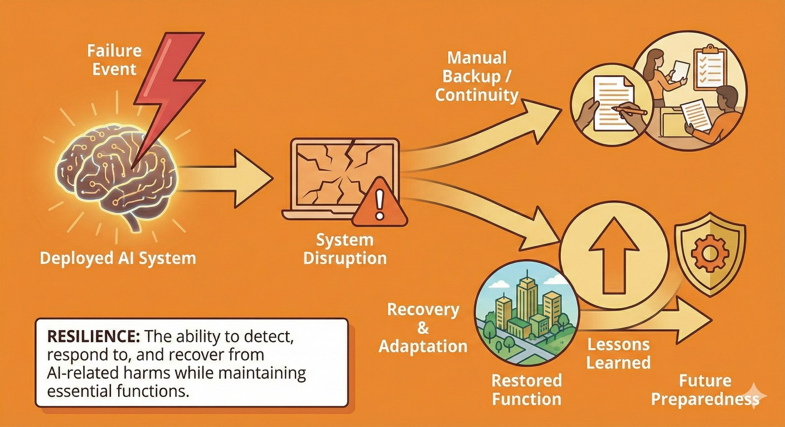

# Resilience: Withstanding and Recovering from Disruptions

## What resilience means

Resilience is the capability to detect, respond to, and recover from AI-related harms while maintaining essential functions and social cohesion.

At the most basic level: **When things go wrong despite our best efforts, can we cope and recover?**

Even with good alignment work and strong control regimes:

- Systems will fail in unexpected ways
- Malicious actors will exploit capabilities
- Compounding events (natural disasters + AI disruption) will overwhelm normal safeguards
- Failures will cascade in ways nobody predicted

Resilience is what ensures these failures don't become catastrophic. It's not about preventing every problem — it's about maintaining function and recovering when problems inevitably occur.

---

## Why resilience matters for Australia

**Resilience is what we must be able to do, regardless of what happens elsewhere.**

We can't control how frontier AI systems are trained overseas. Our regulatory leverage has limits. But we can and must ensure that:

- Essential services keep functioning when AI systems fail
- Communities can cope with disruptions to AI-mediated services  
- Social cohesion holds during information shocks and crises
- Recovery is possible even after major failures

**Australia has specific vulnerabilities that make defence critical:**

**Geographic isolation:** Supply chain disruptions hit us harder and recovery takes longer. We can't easily get help from neighbours.

**Small population:** Fewer people to provide manual fallbacks when automated systems fail. Limited domestic capability in many technical domains.

**High dependence on imports:** Not just physical goods but AI systems, platforms and services. We're more exposed to external failures.

**Tightly optimised systems:** Just-in-time supply chains, lean public services, automated workflows. Efficient but fragile.

**But we also have strengths:**

- Strong institutions and high public trust (relatively speaking)
- History of pulling together during crises
- Strong community networks, especially outside major cities
- Capable emergency management and resilience planning traditions

Effective resilience builds on strengths while directly addressing vulnerabilities.

---

## Three components of resilience

### 1. National and institutional resilience

**Why national resilience matters**

AI systems are becoming embedded in the critical infrastructure and institutions that society depends on. When these systems fail—whether through technical problems, cyber attacks, or cascading effects—the impacts can be national in scope. National and institutional resilience ensures that governments, critical services and major organisations can maintain essential functions even when AI-dependent systems are disrupted.

This isn't just about having backup plans on paper. It's about maintaining genuine capability to operate manually, testing those capabilities under realistic conditions, and building coordination mechanisms that work under stress when normal communication and decision-making channels may be compromised.

**Continuity of essential functions**

- Government, health, energy, communications, finance, logistics, water
- These must continue functioning even when AI systems fail or are compromised
- Manual fallbacks, redundancy, tested contingency plans

**Critical infrastructure protection**

- Understand dependencies on AI systems
- Design for graceful degradation, not just optimisation
- Maintain capability to operate manually when needed
- Test manual operation regularly, not just theoretically

**Cross-sector coordination**

- Many AI-related failures will cascade across sectors
- Need coordination mechanisms that work under stress
- Clear authority and decision-making processes
- Information sharing between government and private operators

**Continuity of government**

- Government itself must function even during AI-enabled disruption
- Alternative communication channels
- Capability to make decisions and coordinate response
- Succession planning that accounts for AI-enabled attacks

**Strategic reserves and redundancy**

- Pre-positioned supplies that don't depend on just-in-time AI optimisation
- Backup systems that use different architectures or providers
- Excess capacity that seems "wasteful" in normal times but critical in crises

---

### 2. Detection and response

**Why detection and response capabilities matter**

Resilience isn't passive—it requires active monitoring, rapid assessment and coordinated response. When AI systems fail or are compromised, the speed and quality of response determines whether a manageable incident becomes a crisis. Detection capabilities provide early warning before failures cascade. Response capabilities ensure that when problems emerge, there's clear authority to act, established playbooks for common scenarios, and coordination mechanisms that function under pressure.

Effective response also means learning from failures. Every incident—whether a near-miss or actual harm—provides data about system vulnerabilities and response effectiveness. Organisations and governments that systematically analyse failures and feed lessons back into their systems become more resilient over time.

**Early warning and monitoring**

- Systems to detect unusual patterns across sectors
- Indicators that AI systems may be failing or compromised
- Intelligence sharing on emerging threats and vulnerabilities

**Rapid assessment**

- Capability to quickly diagnose: AI system failure? Misuse? Attack?
- Understanding causation matters for choosing response
- But can't wait for perfect information — must act under uncertainty

**Clear authority and playbooks**

- Who has authority to respond to different types of AI-related crises?
- Pre-established playbooks for common scenarios
- Flexibility for novel situations
- Balance between speed and appropriate oversight

**Coordinated response**

- Across government (federal, state, local)
- Between government and private sector
- With international partners when relevant
- Communication with public

**Learning from incidents**

- Every failure is data
- Systematic analysis of what went wrong and why
- Feed lessons back into alignment, control and defence improvements
- Share learnings (appropriately) to help others

**Recovery capabilities**

- Not just stopping the immediate harm
- Restoring function, rebuilding trust, addressing secondary impacts
- May need to make hard choices about trade-offs
- Planning for long recovery timelines in some scenarios

---

### 3. Community and household resilience

**Why communities matter**

National and institutional resilience only goes so far. When AI-mediated systems fail, communities and households bear much of the practical burden.

Strong communities are more resilient because they have:

- Local trusted networks that don't depend on digital platforms
- Capability to organise mutual aid and support
- Leadership that can coordinate during disruptions
- Social capital that enables cooperation under stress

Weak communities fragment under pressure, with cascade effects that overwhelm institutional response.

**Local preparedness**

**Basic capabilities that don't depend on AI systems:**

- Food, water, medicine for short-term disruptions
- Cash (when digital payments systems fail)
- Communication plans (when normal channels are down)
- First aid and basic emergency skills
- Knowledge of local resources and hazards

**Trusted local networks:**

- Relationships with neighbours and community organisations
- Local leadership (councils, emergency services, community groups)
- Regular interaction that builds trust before crises hit

**Adaptive capacity:**

- Communities that solve problems together regularly
- Experience with disruptions and recovery
- Diversity of skills and resources
- Willingness to help each other

**Psychological and social resilience**

**Information resilience:**

- Ability to navigate confusing or contradictory information
- Trusted local sources that can cut through noise
- Resistance to panic and manipulation
- Critical thinking without sliding into cynicism or conspiracy

**Social cohesion:**

- Trust in institutions (or at least respect for their role)
- Norms of mutual aid and cooperation
- Resistance to scapegoating and fragmentation during crises
- Capability to disagree while maintaining social fabric

**Adaptive coping:**

- Tolerance for disruption and uncertainty
- Realistic understanding that government can't solve everything instantly
- Willingness to adapt plans and expectations
- Balance between vigilance and avoiding constant panic

---

## Resilience and the threat pathways

Resilience addresses all the threat pathways, but particularly:

**Critical infrastructure disruption:** Resilience is how we cope when cascading failures occur despite safeguards.

**Catastrophic misuse:** Detection and response capabilities limit damage from AI-enabled attacks. Community resilience reduces panic and secondary harms.

**Gradual disempowerment:** Maintaining manual operation capability prevents complete dependence on systems we don't control. Community capability provides alternatives to AI-mediated services.

**Information ecosystem degradation:** Trusted local networks and information resilience help communities navigate when mainstream channels are compromised.

**Loss of control:** If powerful systems misalign, resilience determines whether impacts are recoverable or catastrophic.

---

## What different actors can do

=== "Government & Public Institutions"

    **Immediate actions:**

    - Map critical dependencies on AI systems across essential services
    - Test manual fallbacks — can you actually operate without key systems?
    - Review emergency management plans to explicitly include AI-related scenarios

    **Near-term priorities:**

    - Integrate AI/AGI scenarios into national risk assessments
    - Establish coordination mechanisms for AI-related crises
    - Support local government with guidance and resources
    - Build redundancy and backup systems for critical infrastructure

    **Strategic investments:**

    - Regular cross-sector exercises testing response to AI-enabled disruptions
    - Strategic reserves and excess capacity in critical systems
    - Community preparedness programs that build local capability
    - Research on resilience and recovery from AI-related failures

    **During crises:**

    - Clear, honest communication with the public
    - Coordination across levels of government and with private sector
    - Balance between urgency and avoiding overreaction
    - Support for community-led response and recovery

=== "Business & Industry"

    **Immediate actions:**

    - Map your dependencies on AI systems
    - Test manual operation — not just on paper, but actual drills with staff
    - Identify single points of failure and critical dependencies

    **Near-term priorities:**

    - Develop and test continuity plans that assume AI system failures
    - Build redundancy: backup systems using different providers or architectures
    - Train staff in manual operation of critical functions
    - Establish information sharing with peers and government

    **Ongoing practices:**

    - Regular tabletop exercises using AI-related scenarios
    - Monitor deployed systems for unusual behaviour
    - Maintain skills and relationships that don't depend on automation
    - Build organisational capability to adapt quickly

    **During crises:**

    - Activate contingency plans
    - Share information with regulators and coordination centres
    - Support staff and customers through disruptions
    - Learn from the experience to improve future preparedness

=== "Communities & Households"

    **Immediate actions:**

    - Basic preparedness: water, food, medicine, cash, first aid
    - Know your neighbours and local community resources
    - Understand what local services depend on AI systems

    **Near-term:**

    - Participate in community organisations and local networks
    - Support local emergency preparedness initiatives
    - Build relationships before crises hit
    - Develop non-digital communication plans

    **Ongoing:**

    - Maintain skills that don't depend on AI or digital systems
    - Engage with local government and community planning
    - Support community infrastructure (libraries, community centres, local media)
    - Practice navigating information carefully (verify before sharing, check multiple sources)

    **During crises:**

    - Follow guidance from trusted sources
    - Check on vulnerable neighbours
    - Participate in mutual aid and community response
    - Resist panic and scapegoating — maintain social cohesion

---

## Resilience across the defence-in-depth layers

**Layer 3: Withstand (this is resilience's primary layer)**

- Continuity plans that explicitly account for AI-related threats
- Manual fallbacks and safe modes for critical services
- Community preparedness and trusted networks
- Rapid response and recovery capabilities

**Layer 2: Constrain**

- Reduce exposure and single points of failure
- Maintain alternatives to dominant providers or systems
- Build detection capability for early warning
- Requirements for manual operation capability

**Layer 1: Prevent**

- Limited role at this layer
- Can contribute to international efforts on responsible development
- Reducing dangerous capability development reduces what we need to be resilient against

---

## Challenges and limitations

**Resilience can't do everything:**

**Some harms are irreversible:** Resilience helps you recover, but some impacts (deaths, destroyed trust, economic collapse) can't be undone.

**Resilience is expensive:** Redundancy and excess capacity seem wasteful until you need them. Hard to justify spending on "inefficiency."

**Skills atrophy:** Manual operation capabilities degrade if never used. Testing is essential but disruptive.

**Coordination is hard:** Cross-sector response requires relationships and practice. Can't invent during crises.

**Community capability varies:** Some communities are strong and resilient. Others are fragmented and vulnerable. Can't assume uniform capability.

**Psychological limits:** There's only so much disruption and uncertainty people can cope with before exhaustion and despair set in.

**These are real constraints. But the alternative — depending entirely on containment, alignment and governance — is unacceptable risk.**

---

## The resilience mindset

Good resilience requires a particular mindset:

**Assume failures will happen.** Not pessimism — realism. Complex systems fail. Malicious actors exist. Unknown unknowns are real.

**Plan for cascades.** Single failures are manageable. Multiple simultaneous or cascading failures overwhelm response. Plan for compounding effects.

**Test under stress.** Systems that work in normal times may fail under pressure. Test during busy periods, with incomplete information, with key people unavailable.

**Maintain excess capacity.** Optimisation eliminates slack. Slack is what you draw on during crises. Some "inefficiency" is actually resilience.

**Build relationships before crises.** Trust and coordination can't be improvised. Invest in networks and communication before you need them.

**Learn from every incident.** Near-misses are warnings. Small failures are practice. Extract lessons and share them.

**Balance vigilance and exhaustion.** Can't be on high alert constantly. But can't be complacent either. Find sustainable preparedness.

---

## Key takeaways

**Resilience is not optional.** Containment, alignment and governance will fail sometimes. Resilience is what prevents failures from becoming catastrophic.

**Resilience is broader than security.** It includes social cohesion, community capability, psychological resilience — not just technical robustness.

**Australia must build this capability.** We can't rely on others for our resilience. This is core sovereignty.

**Community resilience is critical.** Government and business can only do so much. Strong communities are essential infrastructure.

**Resilience enables taking risks.** Paradoxically, good resilience allows more innovation. When you know you can cope with failures, you can afford to try new things.

**Start with what you can do now.** Basic preparedness, testing manual operation, building local networks — all achievable immediately.

---

## See resilience in practice

These scenarios show why resilience matters and what it looks like in action:

- **[Critical Infrastructure](../agi-scenarios/scenario-critical-infrastructure.md)** — resilience against system failures
- **[Gradual Disempowerment](../agi-scenarios/scenario-gradual-disempowerment.md)** — adapting to economic transformation
- **[Information Ecosystems](../agi-scenarios/scenario-information-ecosystems.md)** — maintaining truth during manipulation

---

## Where to next

**Other framework pillars:**

- [Framework Overview](index.md) — how resilience serves as the last line of defence
- [Containment](containment.md) — prevention measures that reduce what we need resilience against
- [Alignment](alignment.md) — aligned systems that behave safely reduce resilience demands
- [Governance](governance.md) — coordination mechanisms that enable effective resilience

**Apply resilience concepts:**

- [Community Preparedness](../communities-households/community-preparedness.md) — practical community resilience building
- [National Security](../government-policy/national-security.md) — resilience in security contexts

**Actor-specific guidance:**

- [Government & Policy](../government-policy/) — national and institutional resilience planning
- [Business & Industry](../business-industry/) — organisational continuity and preparedness
- [Communities & Households](../communities-households/) — local resilience and mutual aid
